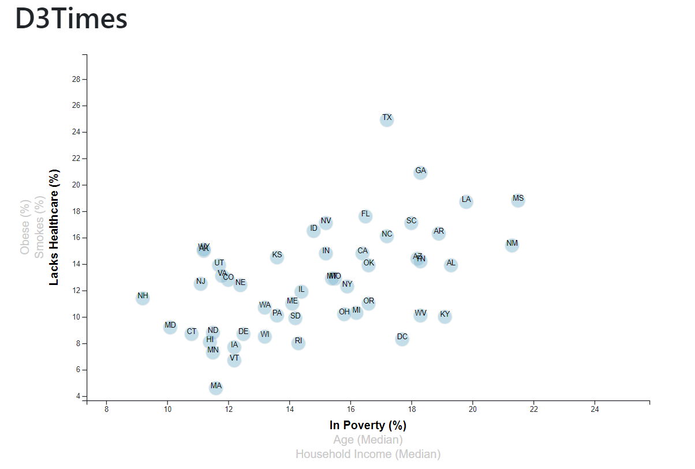

# D3 Homework - Data Journalism and D3

 

Welcome to my project repo!
You can visit the website [here](https://kirstiemccown.github.io/D3-challenge/), or feel free to take a look around the repo folders!
When you visit the website, you will find an interactive scatter plot where you can observe information about the health risks facing particular demographics.

If you are interested, you can find the dataset here: [2014 ACS 1-year estimates:](https://factfinder.census.gov/faces/nav/jsf/pages/searchresults.xhtml)

## About the Website

The website presents an interactive scatter plot where you can compare the different health risks, that face particular demographics and be presented with the figures of each area, including Poverty, Obesity, Household Income and more!

### The Scatter

The scatter plot has been designed to be a visual aid, of information gathered from the US Census Bureau and allow people to view and interogate the data themselves in an easy to use and view manner.  
 

### Created With

This project was created using the following: 

- JavaScript
- D3.js - Data Driven Documents
- Bootstrap
- HTML
- CSS
